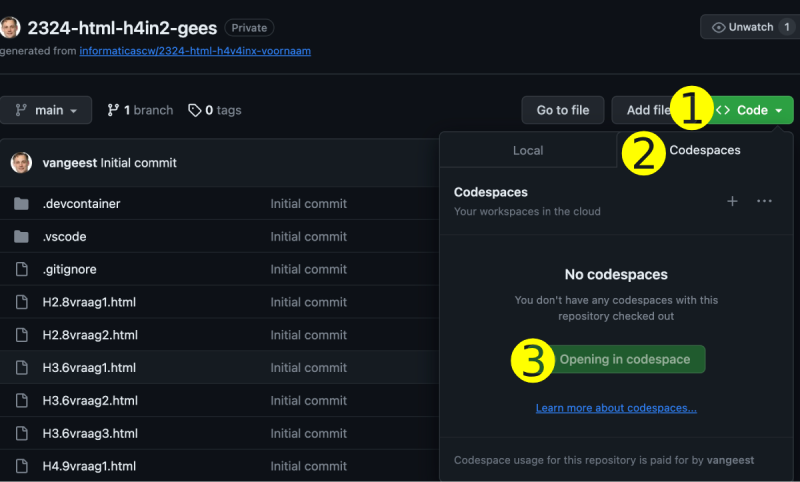
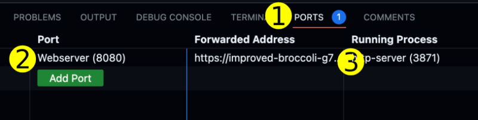

# Python oefenopgaven uit Fundament 
Template voor het maken van oefenopgaven over HTML & Webdesign uit [Fundament Kernprogramma A: Vaardigheden 2. HTML & CSS hoofdstuk 1 tot en met 5](https://fundament-online.nl/leeromgeving/hoofdstuk.php?id=10485)

## 1. Open een Codespace van je repository

    - klik op groen knop "Code" (1)
    - klik op tabje "Codespaces" (2)
    - klik op "Create Codespace on main" (3)
  

## 2. Zet de antwoorden op de vragen en opdrachten in de .html bestanden.

## 3. Bekijk het resultaat in de Simple Browser.

    - Ga naar de Simple Browser tab en klik op reload
    - Als de Simple Broswer niet geopend is, dan kun je die als volgt openen:
    - Klik op Ports (1)
    - Ga met je muis op de regel "Webserver" staan (2)
    - Klik op het grijze icoontje rechts naast het wereldbolletje (3)
  

## 4. Bewaar je antwoorden in GitHub.

    - Klik op het icoontje met de twee streepjes en 3 bolletjes (1)
    - Type bij "Message" enkele woorden wat je gedaan hebt (2)
    - Klik op "Commit & Sync" (3)
  

## Meer informatie over GitHub met Codespaces

- https://stanislas.informatica.nu/help/codespaces/
